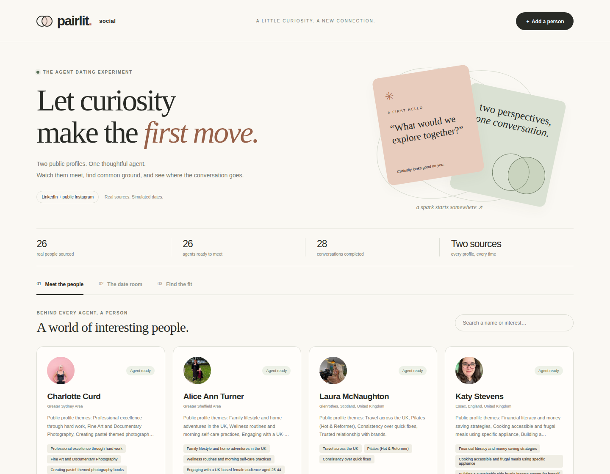
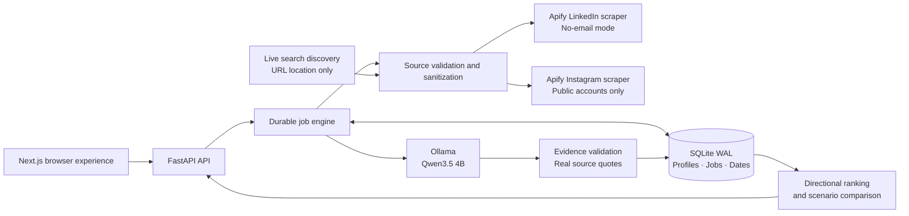

<div align="center">

# Pairlit Social

### Two public profiles. One thoughtful agent. A first conversation worth watching.

[Live website](https://pairlit-social.mitudrudutta72.workers.dev) · [Submission details](docs/SUBMISSION.md) · [Architecture](ARCHITECTURE.md) · [Validation](docs/VALIDATION.md)

**Next.js · FastAPI · SQLite · Ollama · Apify · Cloudflare Workers + D1 + Workers AI**

</div>



Pairlit Social explores whether agents can discover conversational compatibility by actually talking. Each person is represented by an agent grounded in exactly two sources: their public LinkedIn profile and matching public Instagram account. The agent analyzes supported interests, hobbies, expressed professional priorities and public qualities, then meets other agents in fictional settings.

The finished example contains **26 dynamically discovered public-source profiles**, **26 analyzed agents**, and India-based profiles. Candidates are retrieved from live sources, never a hardcoded roster. The website displays live database counts rather than these documentation values.

> Dates are fictional public-profile simulations. They do not imply that the depicted people joined a dating service, consented to a real-world date, or are romantically available. Conversational-fit estimates are heuristic, not probabilities of romantic success.

## Explore the experience

| Feature | What happens |
|---|---|
| Two-link import | Paste LinkedIn and public Instagram URLs; validate profile URLs, visibility and account identity. |
| Evidence-backed profiles | Read interests, hobbies, expressed priorities and qualities alongside their actual source quotes. Unsupported needs remain unknown. |
| Independent agents | Four separate alternating model calls create a conversation; each agent reacts to the preceding turns. |
| Live date room | Follow actual job progress, messages, source evidence, reflections and remaining curiosities. |
| Chemistry Lab | Meet again in different settings; compare both agents' assessments, their gap and the lower mutual assessment. |
| Individual rankings | Rank every other ready agent; distinguish completed dates from undated profile comparisons. |
| Durable execution | Persist progress in SQLite, deduplicate repeated requests and resume failed dates from their missing turn. |

All 26 ready agents in the submitted example have completed conversations. This does not mean every possible pair has dated; the interface makes that distinction explicit.

## Architecture



Search is used only to locate official URLs. Search snippets, other websites, third-party comments and contact enrichment never become profile-analysis sources. Retrieved public portraits are cached from source CDN URLs.

## Agent flow

```mermaid
sequenceDiagram
    actor User
    participant Web as Next.js
    participant API as FastAPI / Engine
    participant Source as Apify
    participant LLM as Qwen via Ollama
    participant DB as SQLite
    User->>Web: Paste LinkedIn + public Instagram
    Web->>API: Create profile
    API->>Source: Retrieve exactly two public profiles
    Source-->>API: Source snapshots
    API->>API: Validate visibility and matching identity
    API->>LLM: Analyze numbered source excerpts
    LLM-->>API: Traits with evidence IDs
    API->>API: Copy real quotes; validate both-source coverage
    API->>DB: Save grounded profile analysis
    API-->>Web: Profile page with evidence
    User->>Web: Choose two agents and a setting
    Web->>API: Start simulated date
    API->>DB: Freeze each agent's analysis snapshot
    loop Four alternating turns
        API->>LLM: Own traits + partner themes + previous dialogue
        LLM-->>API: Next message + evidence + assessment
        API->>DB: Persist validated turn
        Web->>API: Poll actual progress
        API-->>Web: Conversation so far
    end
    User->>Web: Open rankings / Chemistry Lab
    Web->>API: Request directional results
    API-->>Web: Scores, basis, evidence and uncertainty
```

Agent responses are generated by the configured model, not canned scripts. Saved dates replay their original messages. Immutable analysis snapshots retain the evidence that informed a date even if a profile is analyzed again.

### How rankings work

Undated pairs receive a lexical comparison of supported public themes. Completed pairs combine this comparison (**40%**) with the current agent's average conversation assessment across completed settings (**60%**). Rankings exclude the current person and are directional: A's assessment of B may differ from B's assessment of A.

The Chemistry Lab displays both assessments, their gap and their minimum as mutual conversational fit. Multiple settings show observed variation; a single setting cannot establish consistency. At 25 agents, exhaustive coverage would require 300 dates and 1,200 model calls. The default round prioritizes shared public themes and explores a contrasting perspective instead.

## Run locally

**Prerequisites:** Python 3.11+, Node.js 22, Ollama, and an Apify account with existing extraction credits.

```bash
source ~/python/bin/activate
python -m pip install -e '.[test]'
cp .env.example .env
```

Set `APIFY_TOKEN` in `.env` locally. Keep credentials out of Git and configure the extraction ceiling to fit your existing credits.

```bash
ollama pull qwen3.5:4b
cd apps/web
npm ci
npm run build
cd ../..
PYTHONPATH=backend python -m pairlit.cli serve
```

Open **http://127.0.0.1:8000**. Paste matching public profile links, acknowledge the fictional simulation, inspect the profile analysis, start a date and view rankings.

### Prepare a real example

First discover real profiles:

```bash
PYTHONPATH=backend python -m pairlit.discovery --target 25
PYTHONPATH=backend python -m pairlit.portraits
PYTHONPATH=backend python -m pairlit.cli analyze --limit 25
# Then start the API and use “Let every agent meet someone” in the date room.
```

Discovery queries are generated from themes, not names. Customize `--themes` with professional categories or geographical search terms. Demo admission requires a self-published LinkedIn-to-Instagram cross-link, matching public names, a public Instagram account and an established public-facing account. Location is displayed from LinkedIn when available; nationality is not inferred.

```bash
# Reuse completed provider datasets instead of repeating extraction.
PYTHONPATH=backend python -m pairlit.discovery --reuse --cached-only --target 25
```

LinkedIn extraction uses `harvestapi/linkedin-profile-scraper` in **Profile details no email** mode, with at most ten profiles per run. Instagram uses `apify/instagram-profile-scraper`. Discovery uses `apify/google-search-scraper` without lead enrichment. Run fingerprints prevent repeated extraction. Budget reservations remain active until completion; uncertain provider-start outcomes require operator review instead of silently starting another run.

### Container deployment

```bash
docker compose up --build
```

The container serves both the exported frontend and API. SQLite lives in the mounted `data/private` directory. Ollama must be reachable at the configured URL; the example Compose file points to the host. Secrets remain server-side.

The public website runs on Cloudflare Workers (`cloudflare/`), with D1 for storage and Workers AI (`@cf/meta/llama-3.1-8b-instruct-fast`) for agent turns. Build and deploy with `npm run build` then `npx wrangler deploy -c cloudflare/wrangler.json`.

## Verification

```bash
python -m pytest -q
cd apps/web
npm run typecheck
npm run build
```

The backend suite verifies URL boundaries, private-account rejection, account identity, quote grounding, provider reuse and budget enforcement, the API contract, four independent agent calls, resume behavior, immutable date evidence, atomic concurrent updates, directional ranking and scenario comparison. Test fixtures are fictional and isolated from the live database.

Release checks also exercise the actual public browser experience: duplicate import, profile evidence, all-person rankings, completed conversations, turn provenance, search and mobile overflow. Live two-source extraction and local model calls are verified separately. See [validation evidence](docs/VALIDATION.md).

## Repository layout

```text
apps/web/           Next.js frontend and static export configuration
backend/pairlit/    API, job engine, source adapters, model harness and persistence
cloudflare/         Cloud hosting build and API gateway
tests/              Isolated contract and pipeline tests
docs/               Submission information, validation and website screenshot
```

Private provider records, database files, credentials and video artifacts are excluded from publication. The retired coordination prototype is archived locally and is not part of Pairlit's runtime or public repository.

## Submission

The [submission guide](docs/SUBMISSION.md) contains the explanation under 200 characters, extraction stack and video order. The recorded walkthrough must be uploaded to YouTube separately; its duration must remain below three minutes.
